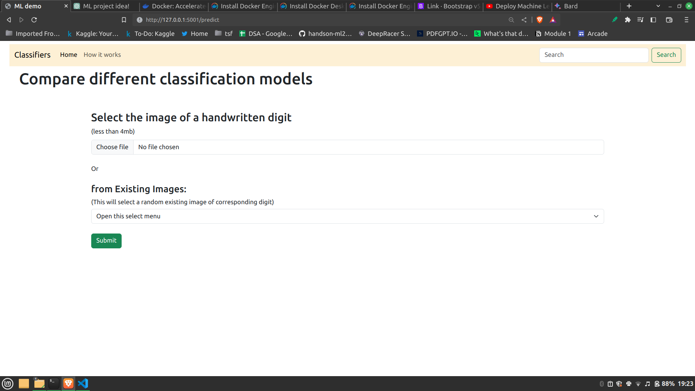
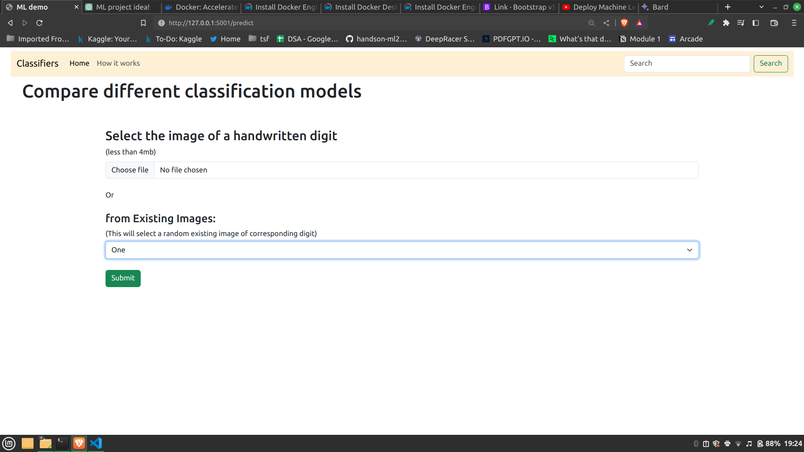
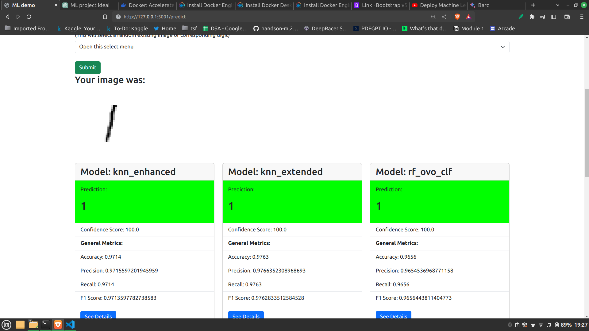
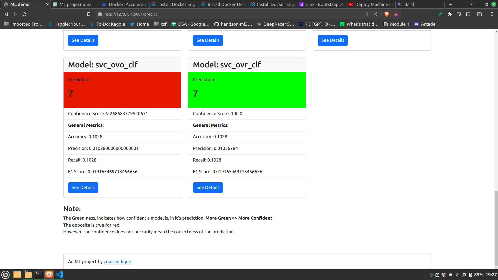

## Description

DigitPredictor is a web application that allows users to predict handwritten digits using machine learning classification models. The application is built using Flask, HTML, and CSS, and it leverages various classification algorithms to accurately predict the digits from user-provided images.

The main aim of this project is to provide a user-friendly interface for predicting digits while also educating users about different classification model metrics like accuracy, precision, recall, and F1 score. The application visualizes the model's performance through confusion matrices and provides an "Advanced View" with decision charts for various classification models.

## Features

- Upload an image of a handwritten digit or select from existing images for prediction.
- Predict the digit using multiple classification models: KNN, SVC (One-vs-One and One-vs-Rest), and Random Forest.
- Visualize the prediction confidence using color-coded indicators.
- Explore model metrics like accuracy, precision, recall, and F1 score.
- Access in-depth information about each model through modals with detailed descriptions and links.
- Gain insights from confusion matrices to understand the model's performance better.
- Engage with an "Advanced View" to observe decision charts for different models.

## Screenshots

*Homepage of the DigitPredictor web application.*

*Digit prediction process with confidence indicators.*

*Model metrics visualizations and confusion matrices.*

*Advanced View with decision charts for different classification models.*

## Installation

1. Clone this repository to your local machine.
2. Install the required Python packages using `pip install -r requirements.txt`.
3. Run the application using `python app.py`.
4. Access the web application locally by visiting `http://localhost:5000` in your web browser.

## Usage

1. Open the DigitPredictor web application in your web browser.
2. Select or upload an image of a handwritten digit (less than 4MB).
3. Click the "Submit" button to see predictions from different classification models.
4. Explore the model metrics and confusion matrices to understand the model's performance.
5. Click on the "Advanced View" button to access decision charts for each classification model.

## Model Metrics

The web application provides insights into the following model metrics:

- Accuracy: The percentage of correctly predicted digits over the total test samples.
- Precision: The ability of the model to correctly predict positive samples among all positive predictions.
- Recall: The ability of the model to correctly identify positive samples among all actual positive samples.
- F1 Score: The harmonic mean of precision and recall, providing a balanced measure of model performance.

## Contributing

Contributions are welcome! If you find any issues or have suggestions for improvement, feel free to submit a pull request or open an issue.

## License

This project is licensed under the [MIT License](link-to-license-file).

## Acknowledgments

- Thanks to [OpenAI](https://openai.com) for providing the GPT-3.5 language model.
- The dataset used for training the classification models is sourced from [MNIST](https://mnist.org).
- Special thanks to the Python and Flask communities for their valuable resources and documentation.
